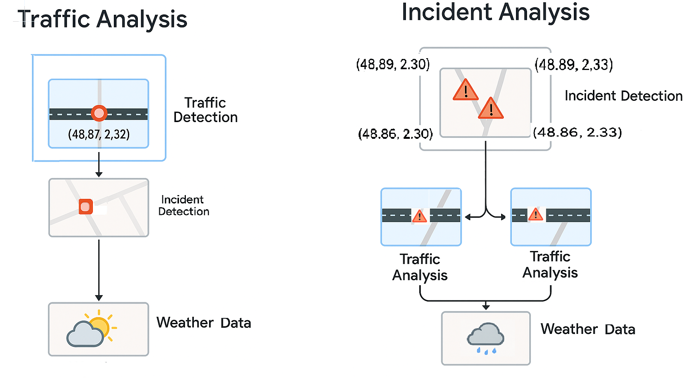

# MLOps Project – Traffic Forecasting and Incident Analysis

## Objective

The goal of this project is to build a complete MLOps pipeline for a real-world use case: **forecasting road traffic** and **analyzing traffic incidents** using real-time data from the TomTom API and a weather API.

## Key Features

- Daily data updates through automated ingestion
- Fully automated processing pipeline (ETL, training, deployment)
- Continuous monitoring of model performance and drift
- Secure and scalable prediction API
- (Optional) Automatic incident summaries generated via LLMs

## Project Structure

This project is organized as follows:

```
.
├── src/
│   ├── live_data_collector.py     # Main script to collect traffic, incident and weather data live
│   └── data/
│       └── arrondissements.csv    # CSV with Paris arrondissement geometries (as polygon coordinates)
├── images/
│   └── data_strategies.png        # Comparison diagram of traffic vs. incident strategies
├── live/                          # Output folder with CSV files per arrondissement
├── logs/                          # Logs of the collection process
├── .env                           # Contains your API keys (not versioned)
├── README.md                      # Project documentation
```


The current structure only includes live collection; extracted datasetsn models etc. will be added later and organized accordingly with dvc/dagshub.

## Data Sources

- **Incidents and traffic**: [TomTom Traffic API](https://developer.tomtom.com/traffic-api/api-explorer)
- **Weather**: [OpenWeatherMap](https://openweathermap.org/api)

## Data Acquisition Strategy

We focus on **live data extraction** instead of historical data for the following reasons:

- The historical `Traffic Stats API` from TomTom is **paid and limited with partial data** during the free trial period.
- With live data, we can automate calls and build a consistent time-series dataset.
  - **Daily limits**: 2500 calls (TomTom), 1000 calls (Weather).

We use a `.csv` file with **bounding boxes (BBOX)** of Paris arrondissements, applied fully or split.


## Strategy Comparison

The figure below illustrates the two possible strategies for data extraction:



| Strategy              | Description                                          | Pros                                              | Cons                                                  |
|-----------------------|------------------------------------------------------|---------------------------------------------------|--------------------------------------------------------|
| **Traffic Analysis**  | Record traffic at fixed points                      | Easy to set up, real-time, no need for incidents  | Many empty calls, low incident yield or non realistic call number to detect               |
| **Incident Analysis** | Get traffic where incidents occurred (via BBOX)     | Targeted, efficient, good incident coverage       | Misses pre-incident flow, no normal traffic context   |

---

## Tech Stack

- **Python**
- **TomTom API**, **Weather API**
- **Pandas, Requests**
- **Git**
- **venv**
- *(Planned)*: uv, FastAPI, ETL & ML pipelines, DVC/Dagshub, CI tools

---

## Setup Instructions

```bash
# 1. Clone the repository
git clone <repo_url>
cd <repo_folder>

# 2. Create and activate virtual env
python -m venv venv
source venv/bin/activate  # or venv\Scripts\activate (Windows)

# 3. Install dependencies
pip install -r requirements.txt

# 4. Set your API key in a .env file
echo "TOMTOM_API_KEY=your_key_here" > .env
echo "WEATHER_KEY=your_key_here" > .env

# 5. Run the collector
python src/live_data_collector.py
```